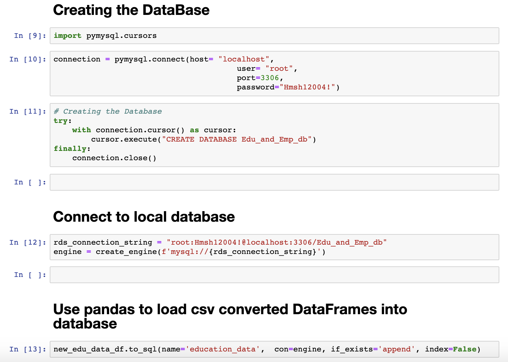
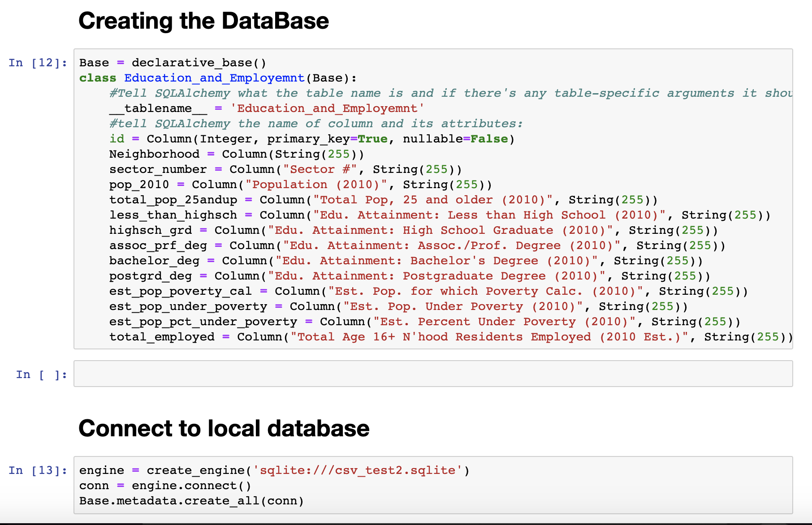

# ETL - Mini project

## Extract, Transform, and Load Data

**Team Members:**
- Hisham Hammour
- Mohammed Ahsan

## Extract:

The data was gathered from www.Data.gov by the The Western Pennsylvania Regional Data Center.

2010 educational and employment data for the all the neighborhood in Allengheny county area.

## Transform:

We've utilized Pandas to:
* Read the CSV files.
* Create DataFrames.
* Dropped all unused columns.

## Load:

we've used two methods to create and load the database:

**mysql:**

**sqlalchemy:**

