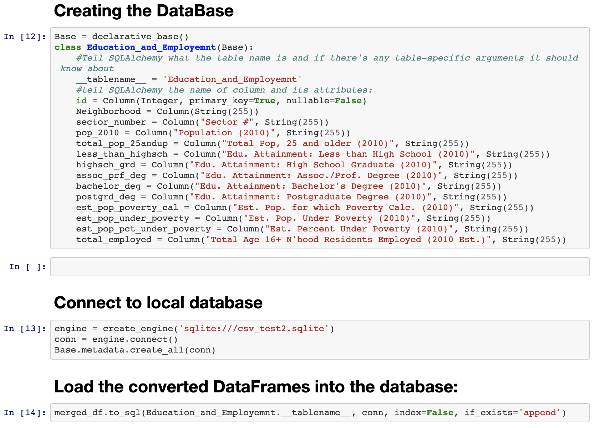

# ETL - Mini project

## Extract, Transform, and Load Data

**Team Members:**
- Hisham Hammour
- Muhammad Ahsan

## Extract:

The data was gathered from www.Data.gov by the The Western Pennsylvania Regional Data Center.

Data collected is for 2010 [educational](https://data.wprdc.org/dataset/40188e1c-6d2e-4f20-9391-607bd3054949/resource/f7b19c6c-aa66-419b-b0e1-9998d7ddfcbc/download/education-income.csv) and [employment]( https://data.wprdc.org/dataset/40188e1c-6d2e-4f20-9391-607bd3054949/resource/fd095080-d32c-4669-8b62-c80f4f32723a/download/employment.csv) data for the all the neighborhood in Allengheny county area.

## Transform:

We've utilized Pandas to:
* Read the CSV files.
* Create DataFrames.
* Merge Dataframes.
* Dropped all unused columns.

## Load:

we've used two methods to create and load the database:

**mysql:**

**sqlalchemy:**

